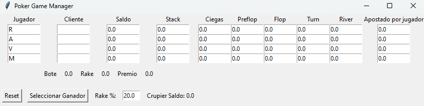

# Poker Habbo

Poker Habbo es una aplicación de gestión de juegos de póker, desarrollada en Python utilizando la biblioteca Tkinter. Permite gestionar los datos de los jugadores, calcular apuestas, repartir premios y gestionar el saldo del crupier.

## Funcionalidades

### 1. Interfaz Gráfica

La aplicación cuenta con una interfaz gráfica sencilla que permite gestionar los datos de los jugadores y las apuestas realizadas en diferentes fases del juego.

### 2. Gestión de Datos de Jugadores

- **Jugador**: Identificación del jugador (R, A, V, M).
- **Cliente**: Nombre del cliente (actualmente no implementado en el código base).
- **Saldo**: Saldo actual del jugador.
- **Stack**: Cantidad de dinero disponible para apostar después de realizar apuestas.
- **Ciegas**: Apuestas obligatorias realizadas al inicio del juego.
- **Preflop**: Apuestas realizadas antes de las cartas comunitarias.
- **Flop**: Apuestas realizadas después de las tres primeras cartas comunitarias.
- **Turn**: Apuestas realizadas después de la cuarta carta comunitaria.
- **River**: Apuestas realizadas después de la quinta carta comunitaria.
- **Apostado por jugador**: Total apostado por cada jugador.

### 3. Gestión de Bote y Premios

- **Bote**: Suma total de las apuestas realizadas por todos los jugadores.
- **Rake**: Comisión del crupier, calculada como un porcentaje del bote total.
- **Premio**: Cantidad restante del bote después de deducir el rake.

### 4. Control del Juego

- **Seleccionar Ganador**: Permite seleccionar al ganador del juego y repartir el premio acumulado.
- **Reset**: Resetea todos los valores a su estado inicial.

### 5. Saldo del Crupier

- Gestión del saldo del crupier basado en el rake acumulado.

## Instalación

1. Clona el repositorio:
   ```bash
   git clone https://github.com/Wembie/Poker-Habbo.git
   
2. Navega al directorio del proyecto:
   ```bash
   cd poker-habbo
3. Instala las dependencias necesarias:
   ```bash
   pip install tkinter
   
## Uso

1. Ejecuta la aplicación:
   ```bash
   python PokerHabbo.py

## Capturas de Pantalla



## Contribuciones

Las contribuciones son bienvenidas. Por favor, abre un issue o envía un pull request para cualquier mejora o corrección.

Hecho y diseñado por Wembie / _Acos_
